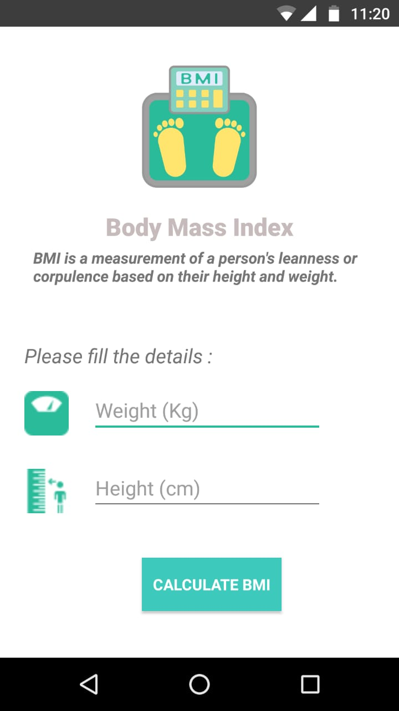
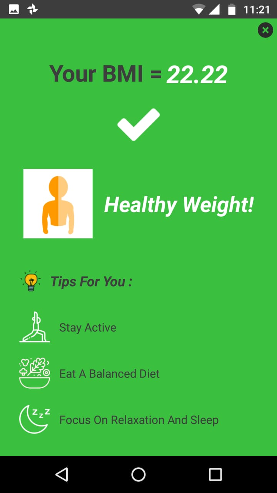
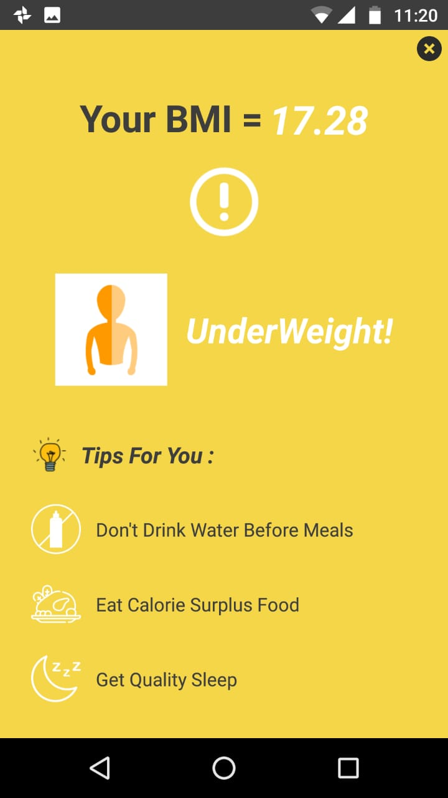
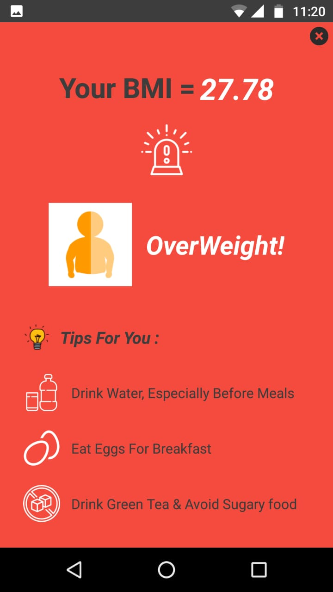

# BMI-Calculator
* Built an android application using **Kotlin** and **Android Studio**.
* Calculates BMI and suggests health tips to maintain a healthy BMI, using **constraint layout** and basic android development tools.

## Enter the Details

  

## Healthy BMI

  

## Under Weight

  

## Over Weight

  

